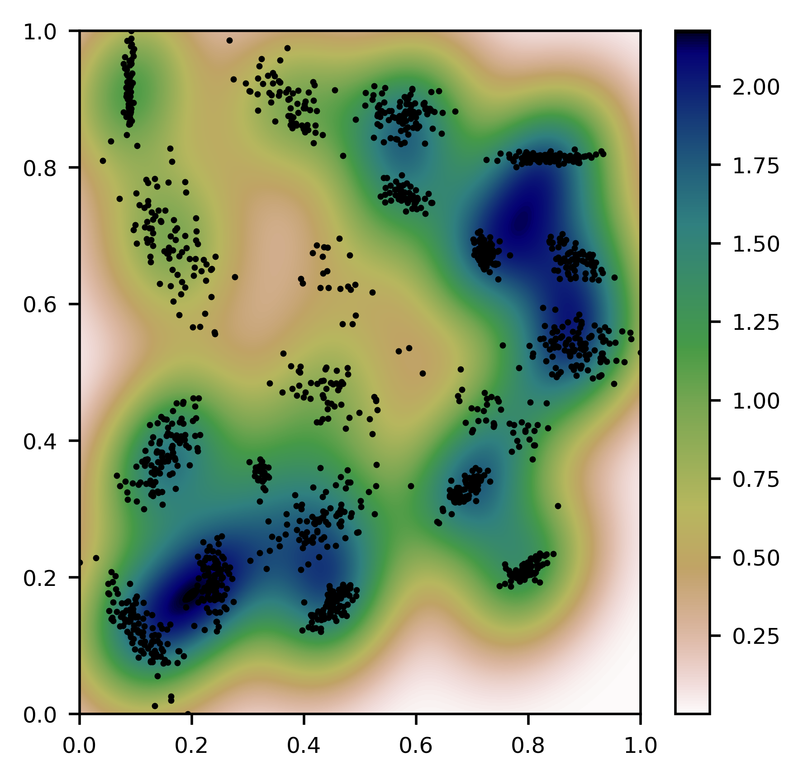
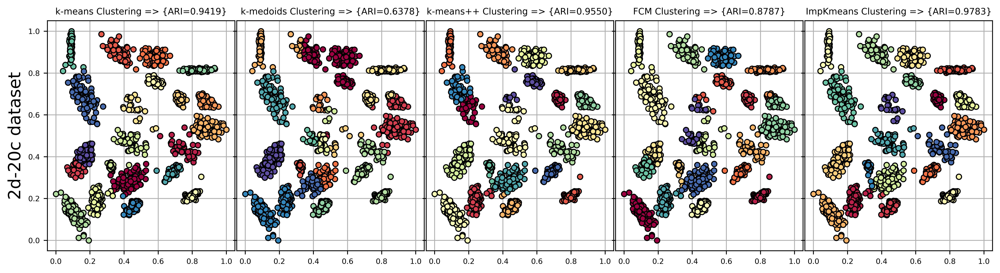
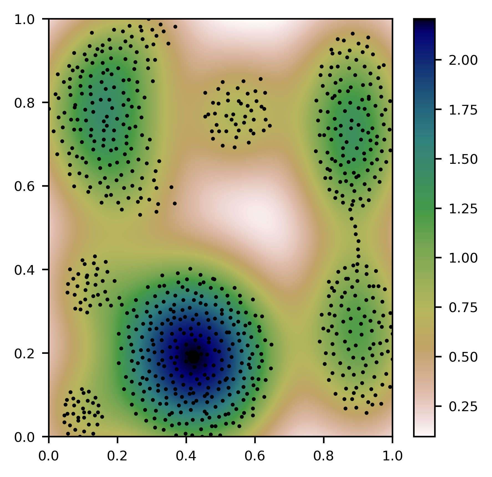
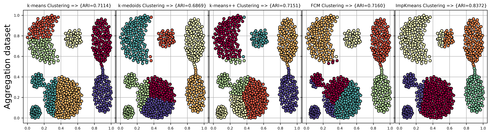

# ImpKmeans
Python Implementation of ImpKmeans, which is an advanced version of Lloyd's k-means algorithm

K-means is the most known clustering algorithm because of its usage simplicity, speed, and efficiency. However, the resultant clusters are influenced by the randomly selected initial centroids. Therefore, many techniques have been implemented to solve the mentioned issue. In this paper, a new version of the k-means clustering algorithm named as ImpKmeans shortly (An Improved Version of K-Means Algorithm by Determining Optimum Initial Centroids Based on Multivariate Kernel Density Estimation and Kd-tree) that uses kernel density estimation to find the optimum initial centroids is proposed. Kernel density estimation is used because it is a nonparametric distribution estimation method that can find density regions.

To understand the efficiency of ImpKmeans, we compared it with classical k-means, k-means++, PAM, and Fuzzy k-means algorithms. Some of the obtained results of the experimental study are shared below. 

  

  

  

  

If you are interested in the algorithm used in your study, please refer to the article shared below:

Şenol, A., (2023). "ImpKmeans: An Improved Version of K-Means Algorithm by Determining Optimum Initial Centroids Based on Multivariate Kernel Density Estimation and Kd-Tree", Acta Polytechnica Hungarica.

